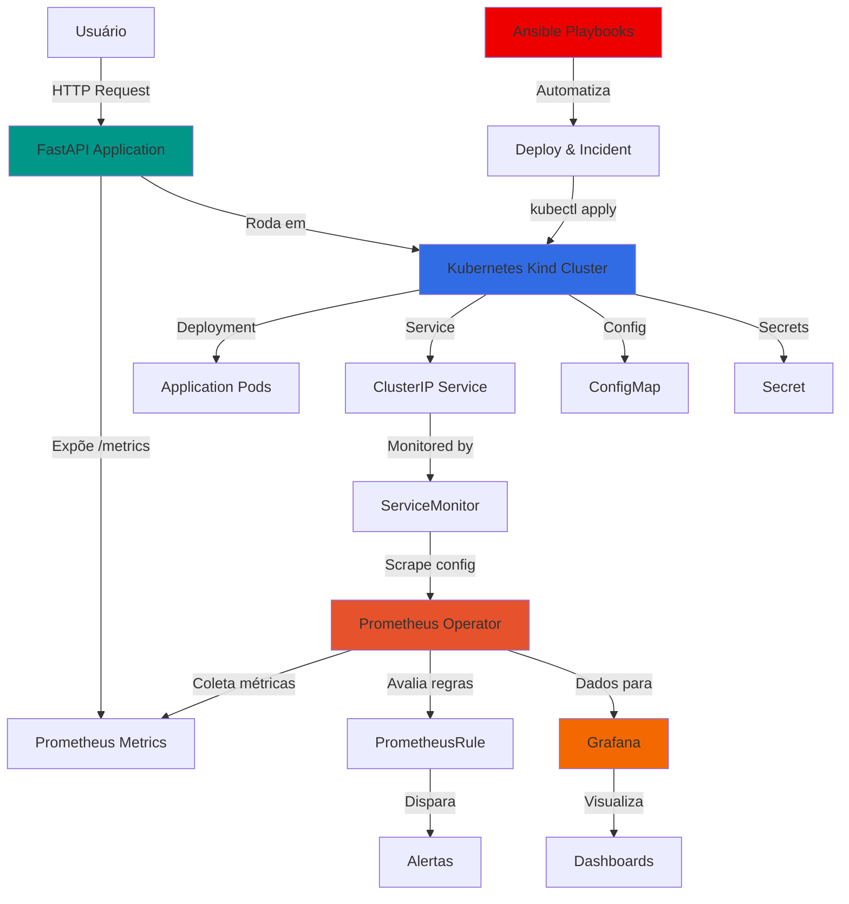
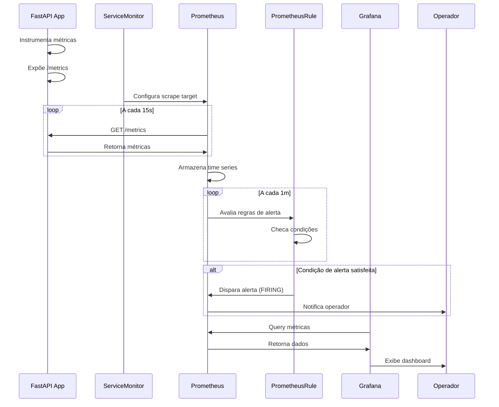
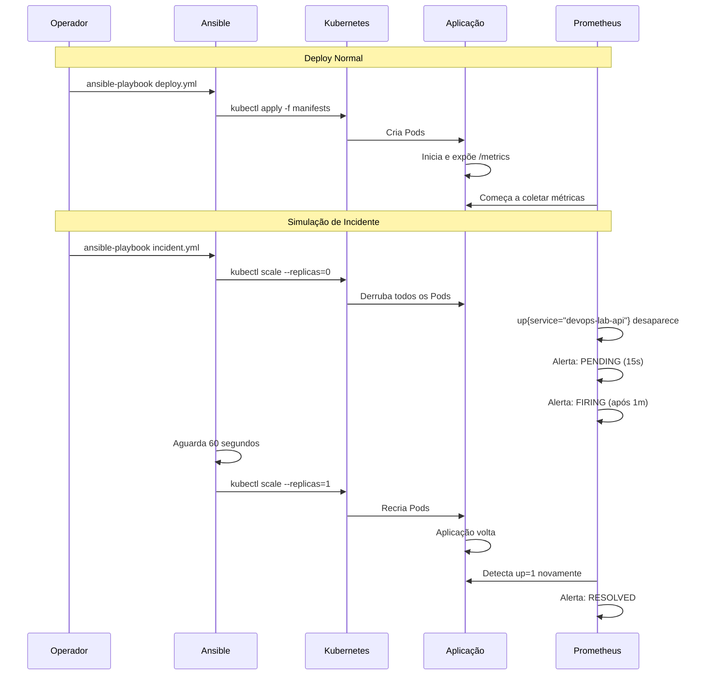
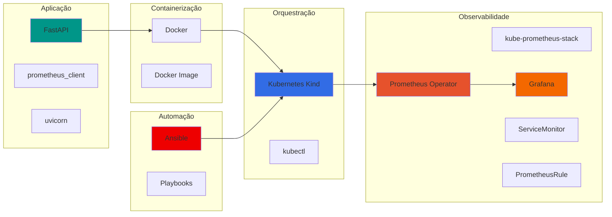
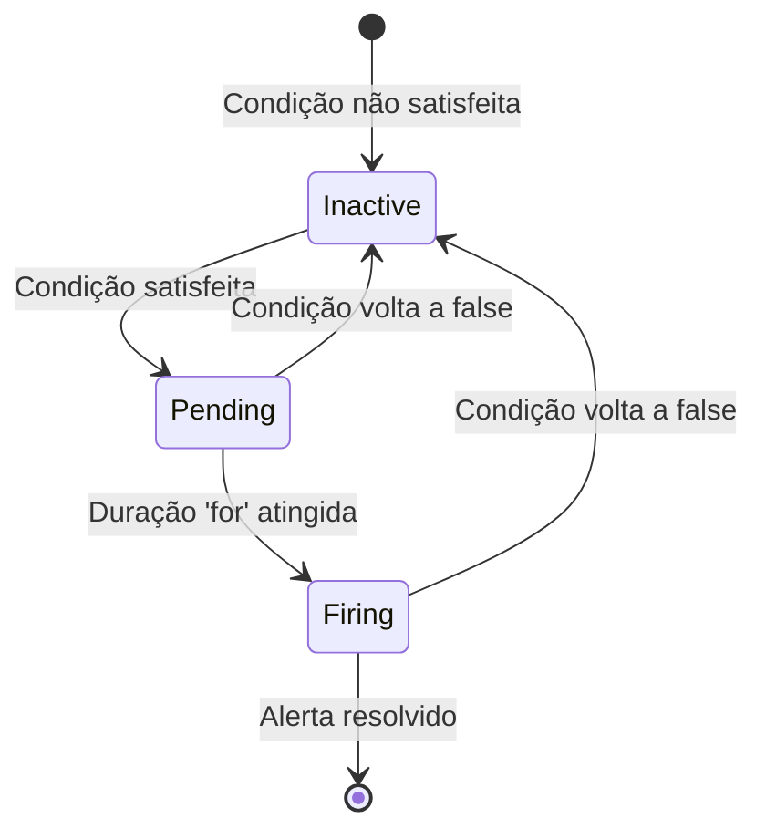
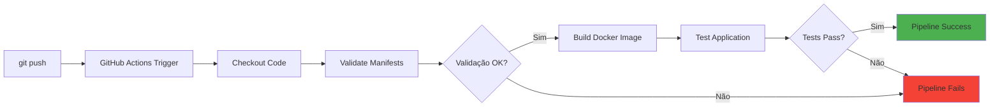
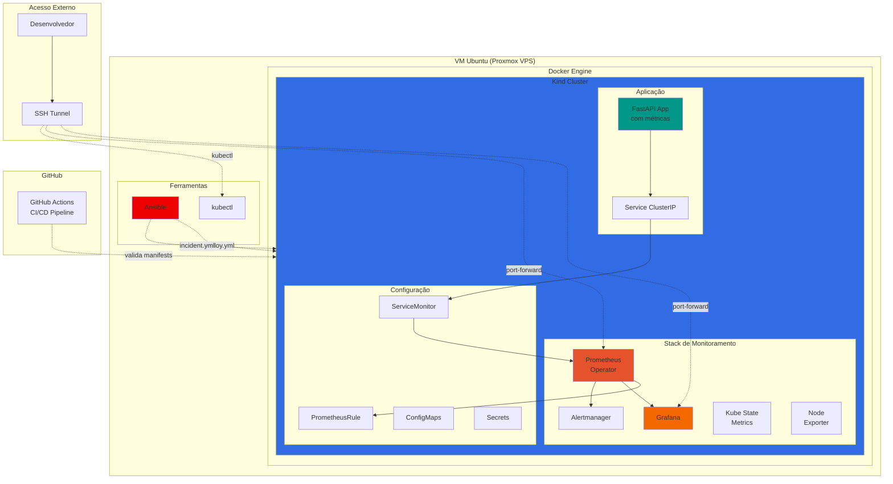
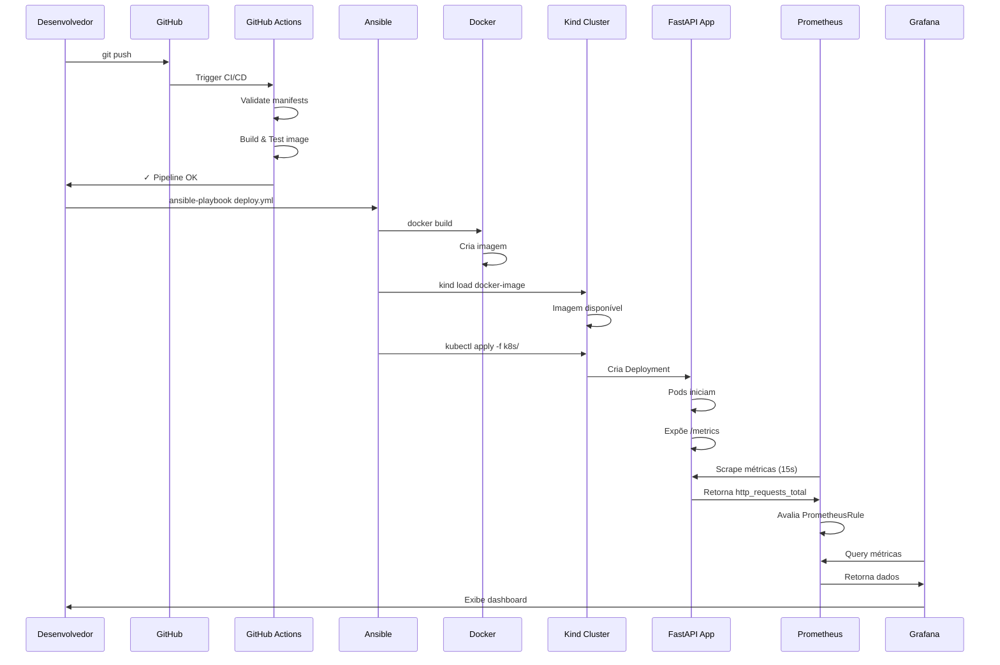
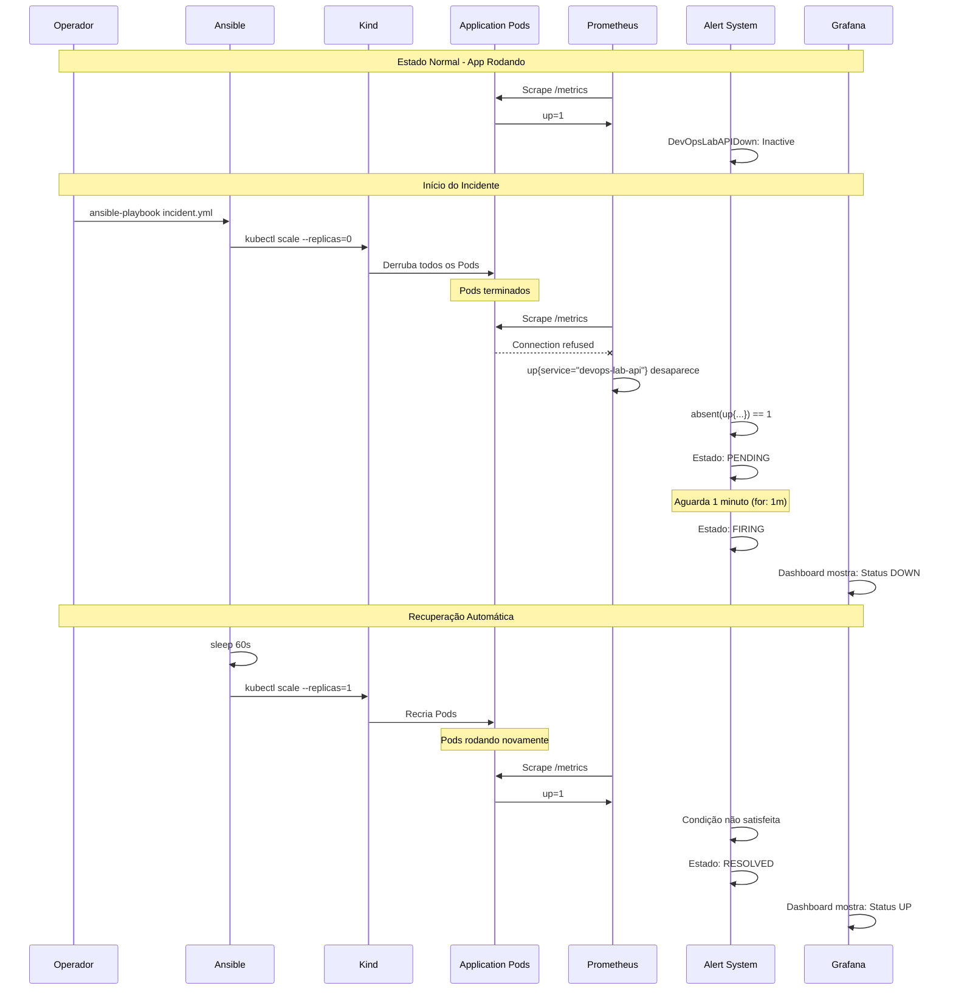
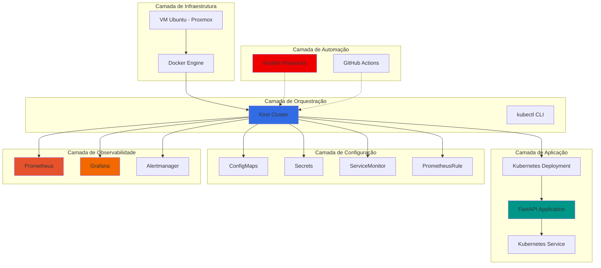

# Cloud-Ready DevOps Lab
### Observabilidade, Monitoramento e Automação com Kubernetes Local

<div align="center">

[](https://github.com/CarlosZambonii/kubernetsProjeto)
[](https://www.linkedin.com/in/carloszambonii/)
[](https://kubernetes.io/)
[](https://prometheus.io/)
[](https://grafana.com/)
[](https://www.ansible.com/)

</div>

---

## Índice

- [Visão Geral](#visão-geral)
- [Arquitetura](#arquitetura)
- [Stack Tecnológica](#stack-tecnológica)
- [Estrutura do Projeto](#estrutura-do-projeto)
- [Aplicação e Métricas](#aplicação-e-métricas)
- [Observabilidade](#observabilidade)
- [Sistema de Alertas](#sistema-de-alertas)
- [Automação](#automação)
- [CI/CD Pipeline](#cicd-pipeline)
- [Post-Mortem: Incidente Simulado](#post-mortem-incidente-simulado)
- [Principais Desafios Técnicos](#principais-desafios-técnicos)
- [Como Executar](#como-executar)
- [Por que Local ao Invés de Cloud](#por-que-local-ao-invés-de-cloud)
- [Infraestrutura Completa](#infraestrutura-completa)
- [Competências Demonstradas](#competências-demonstradas)

---

## Visão Geral

Laboratório DevOps completo que simula ambiente de produção utilizando **VM Ubuntu (Proxmox VPS)**, **Kubernetes local (Kind)**, **Prometheus**, **Grafana**, **alertas automatizados** e **automação com Ansible**.

O projeto implementa:

- Observabilidade com métricas customizadas
- Monitoramento ativo com Prometheus Operator
- Dashboards visuais no Grafana
- Sistema de alertas funcional com PrometheusRule
- Automação de deploy com Ansible
- Simulação de incidentes controlados
- Documentação de post-mortem seguindo práticas SRE
- CI/CD pipeline com GitHub Actions

### Objetivos Técnicos

- Aplicar conceitos de DevOps e SRE
- Implementar observabilidade completa
- Criar alertas que respondem a incidentes reais
- Automatizar operações críticas
- Simular falhas e validar recuperação
- Documentar incidentes com metodologia post-mortem
- Validar comportamento do sistema sob estresse

### Ambiente

**Infraestrutura:** VM Ubuntu rodando em Proxmox VPS  
**Orquestração:** Kubernetes via Kind (Kubernetes in Docker)  
**Acesso:** SSH tunnel + port-forward para segurança  
**Portabilidade:** Arquitetura cloud-native, facilmente adaptável para AWS/Azure/GCP

---

## Arquitetura

### Visão de Alto Nível



### Fluxo de Observabilidade



### Fluxo de Automação



---

## Stack Tecnológica

### Componentes



| Categoria | Tecnologia | Função |
|-----------|------------|--------|
| **Aplicação** | FastAPI | Framework web Python de alta performance |
| **Métricas** | prometheus_client | Biblioteca para instrumentação de métricas |
| **Containerização** | Docker | Empacotamento da aplicação |
| **Orquestração** | Kubernetes (Kind) | Gerenciamento de containers |
| **Monitoramento** | Prometheus Operator | Coleta e armazenamento de métricas |
| **Visualização** | Grafana | Dashboards e gráficos |
| **Descoberta** | ServiceMonitor | Configuração automática de scrape |
| **Alertas** | PrometheusRule | Definição de regras de alerta |
| **Automação** | Ansible | Orquestração de deploys e operações |
| **CI/CD** | GitHub Actions | Pipeline de integração e entrega contínua |
| **Validação** | Kubeval | Validação de manifests Kubernetes |
| **Stack Monitoring** | kube-prometheus-stack | Suite completa de observabilidade |

---

## Estrutura do Projeto

```
kubernetsProjeto/
│
├── .github/
│   └── workflows/
│       └── ci-cd.yaml                    # Pipeline GitHub Actions
│
├── ansible/                              # Automação
│   ├── inventory/
│   │   └── hosts                         # Inventário Ansible (localhost)
│   ├── playbooks/
│   │   ├── deploy.yml                    # Deploy automatizado
│   │   └── incident.yml                  # Simulação de incidente
│   └── roles/
│       └── k8s_deploy/
│           └── tasks/
│               └── main.yml              # Tasks de deploy
│
├── app/                                  # Código da aplicação
│   ├── main.py                           # API FastAPI com métricas
│   ├── requirements.txt                  # Dependências Python
│   └── Dockerfile                        # Imagem Docker
│
├── k8s/                                  # Manifests Kubernetes
│   └── base/
│       ├── deployment.yaml               # Deployment da aplicação
│       ├── service.yaml                  # Service ClusterIP
│       ├── configmap.yaml                # Configurações
│       ├── secret.yaml                   # Dados sensíveis
│       ├── servicemonitor.yaml           # Config de scrape Prometheus
│       └── devops-lab-api-alerts.yaml    # Regras de alerta
│
└── README.md
```

### GitHub Actions

**`.github/workflows/ci-cd.yaml`**
- Pipeline de CI/CD automatizado
- Validação de manifests Kubernetes
- Build e teste da imagem Docker
- Executa a cada push ou pull request

### Ansible

**`playbooks/deploy.yml`**
- Aplica todos os manifests Kubernetes
- Aguarda rollout completar
- Valida que os Pods estão rodando

**`playbooks/incident.yml`**
- Escala a aplicação para 0 réplicas (simula crash)
- Aguarda 60 segundos (permite que alertas disparem)
- Restaura para 1 réplica
- Valida recuperação

### Aplicação

**`main.py`**
- API FastAPI com dois endpoints principais
- Instrumentação customizada de métricas
- Middleware para capturar latência e requisições

**Métricas instrumentadas:**
```python
http_requests_total              # Counter - total de requisições
http_request_latency_seconds     # Histogram - latência por request
```

### Manifests Kubernetes

**`deployment.yaml`**
- Define como os Pods são criados
- Configuração de recursos (CPU, memória)
- Probes de health check
- Injeção de ConfigMap e Secret

**`servicemonitor.yaml`**
- Configura o Prometheus para fazer scrape da aplicação
- Define labels, namespaces e endpoints
- Especifica intervalo de coleta (15s)

**`devops-lab-api-alerts.yaml`**
- Define regras de alerta
- Condição: ausência da métrica `up`
- Duração: alerta dispara após 1 minuto

---

## Aplicação e Métricas

### Endpoints

#### `GET /health`
Health check endpoint

**Resposta:**
```json
{
  "status": "healthy",
  "service": "cloud-ready-devops-lab",
  "timestamp": "2026-02-06T12:34:56"
}
```

#### `GET /metrics`
Endpoint de métricas Prometheus

**Exemplo de resposta:**
```
# HELP http_requests_total Total de requisições HTTP
# TYPE http_requests_total counter
http_requests_total{method="GET",endpoint="/health"} 1523

# HELP http_request_latency_seconds Latência das requisições HTTP
# TYPE http_request_latency_seconds histogram
http_request_latency_seconds_bucket{le="0.005"} 1200
http_request_latency_seconds_bucket{le="0.01"} 1450
http_request_latency_seconds_bucket{le="0.025"} 1500
http_request_latency_seconds_sum 12.5
http_request_latency_seconds_count 1523
```

### Instrumentação

```python
from prometheus_client import Counter, Histogram, generate_latest
from fastapi import FastAPI, Request
import time

app = FastAPI()

REQUEST_COUNT = Counter(
    'http_requests_total',
    'Total de requisições HTTP',
    ['method', 'endpoint']
)

REQUEST_LATENCY = Histogram(
    'http_request_latency_seconds',
    'Latência das requisições HTTP',
    ['method', 'endpoint']
)

@app.middleware("http")
async def metrics_middleware(request: Request, call_next):
    start_time = time.time()
    response = await call_next(request)
    duration = time.time() - start_time
    
    REQUEST_COUNT.labels(
        method=request.method,
        endpoint=request.url.path
    ).inc()
    
    REQUEST_LATENCY.labels(
        method=request.method,
        endpoint=request.url.path
    ).observe(duration)
    
    return response
```

**Características:**
- Métricas customizadas ao invés de apenas defaults
- Middleware automático captura todas as requisições
- Labels permitem agregação e filtragem no Prometheus
- Histogram permite calcular percentis de latência

---

## Observabilidade

### Prometheus

#### Instalação

```bash
helm repo add prometheus-community https://prometheus-community.github.io/helm-charts
helm repo update

helm install prometheus prometheus-community/kube-prometheus-stack \
  --namespace monitoring \
  --create-namespace
```

#### ServiceMonitor

**`servicemonitor.yaml`:**
```yaml
apiVersion: monitoring.coreos.com/v1
kind: ServiceMonitor
metadata:
  name: devops-lab-api-monitor
  namespace: default
  labels:
    release: prometheus
spec:
  selector:
    matchLabels:
      app: devops-lab-api
  endpoints:
  - port: http
    path: /metrics
    interval: 15s
```

**Pontos críticos:**
- Label `release: prometheus` é obrigatória
- ServiceMonitor deve estar no mesmo namespace da aplicação
- Selector deve corresponder aos labels do Service
- Port name deve corresponder ao definido no Service

#### Queries Úteis

**Verificar se a aplicação está sendo monitorada:**
```promql
up{service="devops-lab-api"}
```

**Total de requisições por endpoint:**
```promql
sum(rate(http_requests_total[1m])) by (exported_endpoint)
```

**Latência média:**
```promql
rate(http_request_latency_seconds_sum[1m]) 
/ 
rate(http_request_latency_seconds_count[1m])
```

**Percentil 95 de latência:**
```promql
histogram_quantile(0.95, 
  rate(http_request_latency_seconds_bucket[5m])
)
```

### Grafana

#### Acesso

```bash
kubectl port-forward -n monitoring svc/prometheus-grafana 3000:80

# Credenciais padrão:
# Usuário: admin
# Senha: prom-operator
```

#### Dashboards Implementados

**1. Requests por Segundo**
- Query: `sum(rate(http_requests_total[1m])) by (exported_endpoint)`
- Tipo: Graph
- Mostra tráfego em tempo real

**2. Latência Média**
- Query: `rate(http_request_latency_seconds_sum[1m]) / rate(http_request_latency_seconds_count[1m])`
- Tipo: Gauge
- Unidade: segundos (s)

**3. Status da API**
- Query: `up{service="devops-lab-api"}`
- Tipo: Stat
- Mostra se a aplicação está UP (1) ou DOWN (0)

**4. Total de Requisições**
- Query: `sum(http_requests_total)`
- Tipo: Stat
- Contador acumulado

---

## Sistema de Alertas

### PrometheusRule

```yaml
apiVersion: monitoring.coreos.com/v1
kind: PrometheusRule
metadata:
  name: devops-lab-api-alerts
  namespace: default
  labels:
    release: prometheus
    prometheus: kube-prometheus
spec:
  groups:
  - name: devops-lab-api
    interval: 30s
    rules:
    - alert: DevOpsLabAPIDown
      expr: absent(up{service="devops-lab-api"}) == 1
      for: 1m
      labels:
        severity: critical
      annotations:
        summary: "API DevOps Lab está DOWN"
        description: "A métrica up{service='devops-lab-api'} não está presente há mais de 1 minuto."
```

### Estados do Alerta



**Inactive:** Condição não foi satisfeita

**Pending:** Condição satisfeita, mas ainda dentro do período `for`

**Firing:** Condição satisfeita por tempo maior que `for`, alerta ativo

### Funcionamento

1. Prometheus avalia a regra a cada 30s
2. Se `absent(up{service="devops-lab-api"}) == 1` (métrica não existe), alerta vai para PENDING
3. Se permanecer por 1 minuto, alerta vai para FIRING
4. Quando a métrica volta, alerta é RESOLVED

---

## Automação

### Deploy Automatizado

**Comando:**
```bash
ansible-playbook -i ansible/inventory/hosts ansible/playbooks/deploy.yml
```

**Ações:**
1. Valida que `kubectl` está acessível
2. Aplica todos os manifests do diretório `k8s/base/`
3. Aguarda o rollout do Deployment completar
4. Valida que os Pods estão rodando

### Simulação de Incidente

**Comando:**
```bash
ansible-playbook -i ansible/inventory/hosts ansible/playbooks/incident.yml
```

**Ações:**
1. Simula falha: Escala o Deployment para 0 réplicas
2. Aguarda: 60 segundos para permitir que os alertas disparem
3. Recupera: Restaura para 1 réplica
4. Valida: Verifica que os Pods voltaram

**Valor:**
- Testa o sistema de alertas de forma controlada
- Valida recuperação automática
- Simula situações reais de produção
- Documenta procedimentos de troubleshooting

---

## CI/CD Pipeline

### Visão Geral

Pipeline de integração e entrega contínua implementado com **GitHub Actions**, automatizando validação, build e testes da aplicação a cada push.

### Workflow



### Arquivo de Configuração

**`.github/workflows/ci-cd.yaml`:**

```yaml
name: CI/CD Pipeline

on:
  push:
    branches: [ main ]
  pull_request:
    branches: [ main ]

jobs:
  validate:
    name: Validate Kubernetes Manifests
    runs-on: ubuntu-latest
    
    steps:
      - name: Checkout code
        uses: actions/checkout@v3
      
      - name: Install Kubeval
        run: |
          wget https://github.com/instrumenta/kubeval/releases/latest/download/kubeval-linux-amd64.tar.gz
          tar xf kubeval-linux-amd64.tar.gz
          sudo mv kubeval /usr/local/bin
      
      - name: Validate YAML files
        run: |
          kubeval k8s/base/*.yaml

  build:
    name: Build and Test
    runs-on: ubuntu-latest
    needs: validate
    
    steps:
      - name: Checkout code
        uses: actions/checkout@v3
      
      - name: Build Docker image
        run: |
          docker build -t devops-lab-api:${{ github.sha }} ./app
      
      - name: Test application
        run: |
          docker run -d -p 8000:8000 --name test-app devops-lab-api:${{ github.sha }}
          sleep 5
          curl -f http://localhost:8000/health || exit 1
          curl -f http://localhost:8000/metrics || exit 1
          docker stop test-app
```

### Estágios do Pipeline

**1. Validação de Manifests**
- Verifica sintaxe YAML
- Valida schemas Kubernetes com Kubeval
- Garante que manifests estão corretos antes do build

**2. Build da Imagem**
- Constrói imagem Docker
- Tag com hash do commit para rastreabilidade
- Cache de layers para otimização

**3. Testes**
- Inicia container da aplicação
- Testa endpoint `/health`
- Testa endpoint `/metrics`
- Valida que aplicação está funcional

### Triggers

**Push para main:**
- Executa pipeline completo
- Valida → Build → Test

**Pull Request:**
- Executa pipeline completo
- Feedback antes do merge

### Benefícios

**Qualidade:**
- Detecta erros antes do deploy
- Garante manifests válidos
- Testa funcionalidade básica

**Velocidade:**
- Feedback em minutos
- Automação elimina testes manuais

**Confiabilidade:**
- Processo consistente
- Reduz erros humanos
- Histórico de builds

### Melhorias Implementáveis

**Security Scanning:**
```yaml
- name: Scan vulnerabilities
  uses: aquasecurity/trivy-action@master
  with:
    image-ref: devops-lab-api:${{ github.sha }}
    format: 'sarif'
```

**Push to Registry:**
```yaml
- name: Push to ECR
  if: github.ref == 'refs/heads/main'
  run: |
    aws ecr get-login-password | docker login --username AWS --password-stdin $ECR_URL
    docker tag devops-lab-api:${{ github.sha }} $ECR_URL/devops-lab-api:latest
    docker push $ECR_URL/devops-lab-api:latest
```

**Notifications:**
```yaml
- name: Notify Slack
  uses: 8398a7/action-slack@v3
  with:
    status: ${{ job.status }}
    webhook_url: ${{ secrets.SLACK_WEBHOOK }}
```

---

## Post-Mortem: Incidente Simulado

### Resumo Executivo

Durante teste controlado, a aplicação DevOps Lab API foi intencionalmente escalada para **0 réplicas** para validar o sistema de monitoramento e alertas.

### Linha do Tempo

| Horário | Evento |
|---------|--------|
| 14:30:00 | Execução do playbook `incident.yml` |
| 14:30:05 | Deployment escalado para 0 réplicas |
| 14:30:15 | Último scrape bem-sucedido do Prometheus |
| 14:30:30 | Métrica `up{service="devops-lab-api"}` desaparece |
| 14:31:30 | Alerta `DevOpsLabAPIDown` entra em estado **FIRING** |
| 14:31:35 | Operador visualiza alerta no Prometheus |
| 14:32:00 | Playbook inicia recuperação automática |
| 14:32:05 | Deployment escalado para 1 réplica |
| 14:32:25 | Pod volta ao estado Running |
| 14:32:30 | Prometheus detecta `up=1` novamente |
| 14:32:45 | Alerta `DevOpsLabAPIDown` é resolvido |

**Duração total:** ~2 minutos  
**Tempo até detecção:** 1 minuto  
**Tempo de recuperação:** 30 segundos

### Impacto

**Serviços afetados:**
- API DevOps Lab (100% indisponível)

**Métricas afetadas:**
- `up{service="devops-lab-api"}` → removida
- `http_requests_total` → sem novos dados
- `http_request_latency_seconds` → sem novos dados

**Alertas disparados:**
- `DevOpsLabAPIDown` (severity: critical)

### Causa Raiz

Execução intencional como parte de playbook de simulação:
```bash
kubectl scale deployment/devops-lab-api --replicas=0
```

Este foi um teste controlado para validar:
1. Sistema de monitoramento detecta ausência de métricas
2. Alertas são disparados corretamente
3. Grafana reflete o estado do sistema
4. Procedimentos de recuperação funcionam

### Detecção

1. Prometheus deixou de receber métricas do endpoint `/metrics`
2. Série temporal `up{service="devops-lab-api"}` desapareceu
3. PrometheusRule avaliou: `absent(up{service="devops-lab-api"}) == 1`
4. Após 1 minuto, alerta mudou de PENDING para FIRING

### Resolução

**Ações:**
1. Playbook Ansible executou recuperação automática
2. Comando: `kubectl scale deployment/devops-lab-api --replicas=1`
3. Kubernetes criou novo Pod
4. Pod passou por readiness probe
5. Prometheus detectou endpoint novamente
6. Métrica `up` voltou com valor 1
7. Alerta foi automaticamente resolvido

### Lições Aprendidas

**O que funcionou bem:**
- Sistema de alertas respondeu conforme esperado
- Detecção em 1 minuto após falha
- Grafana refletiu o estado instantaneamente
- Automação via Ansible simplificou operação
- Métricas customizadas forneceram visibilidade

**Observações técnicas:**
- Monitorar ausência de métricas é tão importante quanto presença
- Labels precisam estar alinhadas entre recursos
- Alertas devem ter período `for` para evitar falso positivo
- Observabilidade deve ser testada, não apenas configurada

---

## Principais Desafios Técnicos

### 1. ServiceMonitor Ignorado

**Problema:** ServiceMonitor criado, mas Prometheus não fazia scrape.

**Causa:** Label `release: prometheus` estava faltando no ServiceMonitor.

**Solução:**
```yaml
metadata:
  labels:
    release: prometheus
```

O Prometheus Operator usa label selectors para processar ServiceMonitors. Sem essa label, o recurso é ignorado.

---

### 2. Namespace Incorreto

**Problema:** ServiceMonitor em namespace diferente da aplicação.

**Causa:** ServiceMonitor estava em `monitoring`, aplicação em `default`.

**Solução:** Mover ServiceMonitor para namespace `default` ou configurar `namespaceSelector`:
```yaml
spec:
  namespaceSelector:
    matchNames:
    - default
```

---

### 3. Métrica `up` Não Encontrada

**Problema:** Query `up{job="devops-lab-api"}` retornava vazio.

**Causa:** A label `job` é gerada automaticamente e não corresponde ao nome do ServiceMonitor.

**Solução:** Usar label correta:
```promql
up{service="devops-lab-api"}
```

---

### 4. Confusão Builder vs Code no Grafana

**Problema:** Queries complexas não funcionavam no modo Builder.

**Causa:** O modo Builder tem limitações para queries Prometheus complexas.

**Solução:** Sempre usar modo Code para queries PromQL:
```promql
rate(http_request_latency_seconds_sum[1m]) 
/ 
rate(http_request_latency_seconds_count[1m])
```

---

### 5. Port-Forward Falha com Pod Down

**Problema:** `kubectl port-forward` falhava imediatamente.

**Causa:** Service existe, mas nenhum Pod estava rodando.

**Solução:** Verificar antes:
```bash
kubectl get pods -l app=devops-lab-api
kubectl scale deployment/devops-lab-api --replicas=1
kubectl wait --for=condition=ready pod -l app=devops-lab-api
kubectl port-forward svc/devops-lab-api 8080:80
```

---

### 6. Caminho Relativo Errado no Ansible

**Problema:** Playbook não encontrava manifests.

**Causa:** Ansible executa tasks relativo ao diretório do playbook.

**Solução:**
```yaml
command: kubectl apply -f ../../k8s/base/
```

---

### 7. Alertas Não Aparecem no Graph

**Problema:** Query `ALERTS{}` não retornava nada.

**Causa:** `ALERTS` é uma série temporal dinâmica que só existe quando há alertas ativos.

**Solução:** Usar a query da regra diretamente:
```promql
absent(up{service="devops-lab-api"})
```

---

### 8. Label Faltando no PrometheusRule

**Problema:** PrometheusRule criado, mas alertas não aparecem.

**Causa:** Falta label `release: prometheus`.

**Solução:**
```yaml
metadata:
  labels:
    release: prometheus
    prometheus: kube-prometheus
```

---

### 9. ImagePullBackOff em Cluster Remoto

**Problema:** Pods falhando com `ImagePullBackOff` na VPS.

**Sintomas:**
- `kubectl get pods` mostra ErrImagePull
- Pod não consegue baixar imagem

**Causa:** Cluster Kind na VPS não tinha acesso à imagem Docker construída localmente.

**Solução:**
1. Build da imagem na VPS:
   ```bash
   docker build -t devops-lab-api:latest ./app
   ```

2. Carregar no Kind:
   ```bash
   kind load docker-image devops-lab-api:latest --name devops-lab
   ```

3. Adicionar no Deployment:
   ```yaml
   spec:
     containers:
     - name: api
       image: devops-lab-api:latest
       imagePullPolicy: Never  # Força uso da imagem local
   ```

**Lição aprendida:**
Cluster remoto não compartilha cache Docker local. Imagens precisam ser explicitamente carregadas ou disponibilizadas via registry.

---

### Resumo

| Erro | Causa | Tempo Perdido |
|------|-------|---------------|
| ServiceMonitor ignorado | Falta label `release` | ~2 horas |
| Namespace incorreto | ServiceMonitor em outro NS | ~1 hora |
| Query `up` vazia | Label `job` errada | ~3 horas |
| Grafana Builder | Limitação da ferramenta | ~1 hora |
| Port-forward falha | Pod down | ~30 min |
| Ansible path | Caminho relativo errado | ~1 hora |
| ALERTS vazio | Query errada | ~2 horas |
| PrometheusRule ignorado | Falta label | ~1 hora |
| ImagePullBackOff VPS | Imagem não carregada no Kind | ~2 horas |

**Total de troubleshooting:** ~14 horas

---

## Como Executar

### Pré-requisitos

**Instalação Linux (Ubuntu/Debian):**

```bash
# Docker
sudo apt-get update
sudo apt-get install -y docker.io
sudo usermod -aG docker $USER

# Kind
curl -Lo ./kind https://kind.sigs.k8s.io/dl/v0.20.0/kind-linux-amd64
chmod +x ./kind
sudo mv ./kind /usr/local/bin/kind

# kubectl
curl -LO "https://dl.k8s.io/release/$(curl -L -s https://dl.k8s.io/release/stable.txt)/bin/linux/amd64/kubectl"
chmod +x kubectl
sudo mv kubectl /usr/local/bin/

# Helm
curl https://raw.githubusercontent.com/helm/helm/main/scripts/get-helm-3 | bash

# Ansible
sudo apt-get install -y ansible
```

**Instalação Mac:**

```bash
brew install docker kind kubectl helm ansible
```

### Passo 1: Clone o Repositório

```bash
git clone https://github.com/CarlosZambonii/kubernetsProjeto.git
cd kubernetsProjeto
```

### Passo 2: Criar Cluster Kubernetes

```bash
kind create cluster --name devops-lab
kubectl cluster-info
kubectl get nodes
```

### Passo 3: Instalar Prometheus Stack

```bash
helm repo add prometheus-community https://prometheus-community.github.io/helm-charts
helm repo update

kubectl create namespace monitoring

helm install prometheus prometheus-community/kube-prometheus-stack \
  --namespace monitoring \
  --set prometheus.prometheusSpec.serviceMonitorSelectorNilUsesHelmValues=false \
  --set prometheus.prometheusSpec.ruleSelectorNilUsesHelmValues=false

kubectl wait --for=condition=ready pod -l app.kubernetes.io/name=prometheus -n monitoring --timeout=5m
```

### Passo 4: Build e Load da Imagem

```bash
docker build -t devops-lab-api:latest ./app
kind load docker-image devops-lab-api:latest --name devops-lab
```

### Passo 5: Deploy Automatizado

```bash
ansible-playbook -i ansible/inventory/hosts ansible/playbooks/deploy.yml
kubectl get all -l app=devops-lab-api
```

### Passo 6: Acessar a Aplicação

```bash
kubectl port-forward svc/devops-lab-api 8080:80

# Em outro terminal:
curl http://localhost:8080/health
```

### Passo 7: Acessar Prometheus

```bash
kubectl port-forward -n monitoring svc/prometheus-kube-prometheus-prometheus 9090:9090

# Abrir: http://localhost:9090
# Status → Targets → serviceMonitor/default/devops-lab-api-monitor/0
```

### Passo 8: Acessar Grafana

```bash
kubectl port-forward -n monitoring svc/prometheus-grafana 3000:80

# Abrir: http://localhost:3000
# Usuário: admin
# Senha: prom-operator
```

### Passo 9: Gerar Tráfego

```bash
for i in {1..1000}; do 
  curl -s http://localhost:8080/health > /dev/null
  sleep 0.1
done
```

### Passo 10: Simular Incidente

```bash
ansible-playbook -i ansible/inventory/hosts ansible/playbooks/incident.yml

# Acompanhar em:
# http://localhost:9090/alerts
# http://localhost:3000 (Grafana dashboard)
```

---

## Por que Local ao Invés de Cloud

### Ambiente de Desenvolvimento Real

Este projeto foi desenvolvido para rodar em ambiente local/VPS por questões práticas e de custo, mas utiliza as mesmas tecnologias e padrões de produção cloud. A arquitetura é **cloud-native** e pode ser facilmente adaptada para ambientes como AWS EKS, Azure AKS ou Google GKE, necessitando apenas ajustes em componentes de infraestrutura (LoadBalancer, Storage, Registry).

### Benefícios do Ambiente Local

| Aspecto | Local/VPS | Cloud Gerenciada |
|---------|-----------|------------------|
| **Custo** | R$ 0,00 (local) ou R$ 30-50/mês (VPS) | R$ 950+/mês |
| **Aprendizado** | Controle total de cada camada | Abstrações escondem detalhes |
| **Experimentação** | Ilimitada | Limitada por custo |
| **Troubleshooting** | Acesso total ao sistema | Logs e métricas limitados |

### Portabilidade

O conhecimento e código desenvolvidos aqui são 100% transferíveis para ambientes cloud:

- Manifests Kubernetes são idênticos
- Prometheus Operator funciona da mesma forma
- ServiceMonitors e PrometheusRules não mudam
- Ansible playbooks precisam apenas de ajuste de inventory
- Conceitos de observabilidade são os mesmos

**Migração para cloud:** Trocar Kind por EKS/AKS/GKE, ajustar Service type para LoadBalancer, e configurar registry (ECR/ACR/GCR). O restante permanece igual.

---

## Infraestrutura Completa

### Visão Geral da Infraestrutura



### Fluxo de Deploy e Monitoramento




### Fluxo de Simulação de Incidente



### Camadas da Stack



---

## Contato

**Carlos Zambonii**

[](https://www.linkedin.com/in/carloszambonii/)
[](https://github.com/CarlosZambonii)

---

<div align="center">

Última atualização: Fevereiro 2026

</div>
