# Cloud-Ready DevOps Lab
### Aprenda Kubernetes, CI/CD e DevOps do Zero (sem gastar nada!)

<div align="center">

[](https://github.com/CarlosZambonii/kubernetsProjeto)
[](https://www.linkedin.com/in/carloszambonii/)
[](https://kubernetes.io/)
[](https://fastapi.tiangolo.com/)
[](https://www.docker.com/)

</div>

---

## Índice

- [O que é este projeto?](#o-que-é-este-projeto)
- [Por que não usamos AWS? (a verdade sincera)](#por-que-não-usamos-aws-a-verdade-sincera)
- [Como funciona tudo (com fluxogramas!)](#como-funciona-tudo-com-fluxogramas)
- [Tecnologias utilizadas](#tecnologias-utilizadas)
- [Estrutura do projeto](#estrutura-do-projeto)
- [Guia completo: Como testar localmente](#guia-completo-como-testar-localmente)
- [Como isso funcionaria na AWS](#como-isso-funcionaria-na-aws)
- [Pipeline CI/CD explicado](#pipeline-cicd-explicado)
- [Próximos passos](#próximos-passos)
- [FAQ](#faq)
- [Contato](#contato)

---

## O que é este projeto?

Imagine que você quer aprender **Kubernetes**, **CI/CD**, **Docker** e todas essas tecnologias que as empresas pedem, mas:

- Não quer gastar dinheiro com AWS/Azure/GCP
- Não quer apenas fazer tutoriais superficiais
- Quer um projeto **real** que funciona de verdade
- Quer entender **cada camada** da tecnologia
- Quer algo que você possa colocar no **portfólio**

**Este é exatamente esse projeto!**

Aqui você vai aprender a criar uma aplicação web completa (uma API) e fazer o deploy dela usando:
- **Docker** (para empacotar a aplicação)
- **Kubernetes** (para orquestrar os containers)
- **GitHub Actions** (para automatizar tudo)
- **Kind** (Kubernetes local - de graça!)

E o melhor: **tudo 100% gratuito** rodando na sua máquina!

---

## Por que não usamos AWS? (a verdade sincera)

### A Realidade

Vamos ser sinceros: **AWS custa dinheiro**. E quando você está aprendendo ou construindo um portfólio, não faz sentido gastar $20, $50 ou até $100+ por mês só para manter um projeto rodando.

```
┌─────────────────────────────────────────┐
│  "Ah, mas tem Free Tier!"               │
├─────────────────────────────────────────┤
│  Free Tier dura apenas 12 meses         │
│  Limites muito baixos (750h/mês)        │
│  Um erro e você recebe uma conta        │
│  Não pode experimentar livremente       │
└─────────────────────────────────────────┘
```

### Nossa Solução

Ao invés de depender da AWS, nós criamos um **ambiente Kubernetes real** na sua própria máquina usando **Kind** (Kubernetes in Docker).

**Vantagens:**

| Aspecto | Local (Kind) | AWS (Produção) |
|---------|--------------|----------------|
| **Custo** | R$ 0,00 | R$ 200-500+/mês |
| **Aprendizado** | Você entende TUDO | Abstração esconde detalhes |
| **Velocidade** | Testa instantaneamente | Deploy leva minutos |
| **Controle** | Controle total | Limitado pelo provedor |
| **Portfólio** | Mostra conhecimento profundo | "Só cliquei em botões" |

### Mas é Kubernetes de Verdade?

**SIM!** O Kind roda Kubernetes 100% real. A diferença é apenas onde ele roda:

```
AWS EKS = Kubernetes rodando em servidores da Amazon
Kind    = Kubernetes rodando no seu computador

Mas o Kubernetes em si? É EXATAMENTE o mesmo! 
```

---

##  Como funciona tudo (com fluxogramas!)

### Visão Geral da Arquitetura

```mermaid
graph TB
    A[ Desenvolvedor] -->|1. git push| B[GitHub Repository]
    B -->|2. Trigger| C[GitHub Actions CI/CD]
    
    C -->|3. Valida| D{Manifests OK?}
    D -->| Não| E[Pipeline falha]
    D -->| Sim| F[Build Docker Image]
    
    F -->|4. Cria imagem| G[Docker Image: devops-lab-api]
    G -->|5. Deploy| H[Kubernetes Cluster Kind]
    
    H --> I[ Deployment]
    H --> J[ ConfigMap]
    H --> K[ Secret]
    H --> L[ Service]
    
    L -->|6. Expõe| M[ Aplicação Rodando]
    M -->|7. Acesso| N[ Usuário Final]
    
    style A fill:#e1f5ff
    style C fill:#fff4e1
    style H fill:#e8f5e9
    style M fill:#f3e5f5
```



### Fluxo Detalhado: Do Código ao Deploy

```mermaid
sequenceDiagram
    participant Dev as  Desenvolvedor
    participant Git as  GitHub
    participant CI as  GitHub Actions
    participant Docker as  Docker
    participant K8s as  Kubernetes
    participant App as  Aplicação

    Dev->>Git: 1. git push (código novo)
    Git->>CI: 2. Webhook: "Código mudou!"
    
    CI->>CI: 3. Valida manifests .yaml
    
    alt  Validação OK
        CI->>Docker: 4. docker build
        Docker->>Docker: 5. Cria imagem
        CI->>K8s: 6. kubectl apply
        K8s->>K8s: 7. Cria Pods
        K8s->>App: 8. Inicia containers
        App->>App: 9.  Aplicação rodando!
    else  Validação falhou
        CI->>Dev:  Pipeline falhou - corrija o código
    end
```



### O que acontece dentro do Kubernetes?


**O que cada coisa faz?**

-  **Service**: É como o "porteiro" que direciona as requisições para os Pods certos
-  **ConfigMap**: Guarda configurações (como "ambiente=dev", "versão=1.0")
-  **Secret**: Guarda informações sensíveis (senhas, tokens, chaves API)
-  **Pod**: É onde a aplicação realmente roda (container Docker)

---

##  Tecnologias utilizadas

### Stack Completo

```mermaid
graph TD
    A[ Código da Aplicação] --> B[FastAPI + Python]
    C[ Containerização] --> D[Docker]
    E[ Orquestração] --> F[Kubernetes Kind]
    G[ CI/CD] --> H[GitHub Actions]
    I[ Configuração] --> J[ConfigMap + Secret]
    K[ Validação] --> L[Kubeval]
    
    style B fill:#009688
    style D fill:#2496ED
    style F fill:#326CE5
    style H fill:#2088FF
    style J fill:#FF6B6B
    style L fill:#4CAF50
```



| Ferramenta | O que faz | Por que usamos |
|------------|-----------|----------------|
| **FastAPI** | Framework web Python | Rápido, moderno, com documentação automática |
| **Docker** | Empacota a aplicação | Garante que funciona em qualquer lugar |
| **Kubernetes (Kind)** | Orquestra containers | Gerencia deploy, escala e recuperação automática |
| **GitHub Actions** | Automatiza CI/CD | Testa e faz deploy automaticamente |
| **ConfigMap** | Configurações externas | Muda configurações sem rebuild |
| **Secret** | Dados sensíveis | Guarda senhas de forma segura |
| **Kubeval** | Valida YAML | Garante que os manifests estão corretos |

---

##  Estrutura do projeto

```
kubernetsProjeto/
│
├──  app/                          # Código da aplicação
│   ├── main.py                      # API FastAPI principal
│   ├── requirements.txt             # Dependências Python
│   └── Dockerfile 
├──  k8s/                          # Manifests Kubernetes
│   └── base/
│       ├── deployment.yaml          # Define como criar os Pods
│       ├── service.yaml             # Expõe a aplicação
│       ├── configmap.yaml           # Configurações
│       └── secret.yaml              # Senhas e tokens
│
├──  .github/
│   └── workflows/
│       └── ci-cd.yaml               # Pipeline de automação
│                      # Receita para criar a imagem
└── README.md                        # 👈 Você está aqui!
```

### Entendendo cada arquivo

####  `app/main.py`
```python
# Nossa aplicação web simples
# Responde com informações sobre o serviço
from fastapi import FastAPI

app = FastAPI()

@app.get("/")
def read_root():
    return {
        "service": "cloud-ready-devops-lab",
        "env": "dev",
        "status": "running"
    }
```

####  `k8s/base/deployment.yaml`
```yaml
# Diz ao Kubernetes:
# - Quantos Pods criar
# - Qual imagem usar
# - Quais variáveis de ambiente injetar
```

####  `.github/workflows/ci-cd.yaml`
```yaml
# Automatiza:
# 1. Validação dos arquivos
# 2. Build da imagem Docker
# 3. Testes
# Tudo isso acontece automaticamente a cada push!
```

---

##  Guia completo: Como testar localmente

### Pré-requisitos

Antes de começar, você precisa instalar algumas ferramentas. Não se preocupe, é tudo gratuito!

####  Instalar Docker

**Windows/Mac:**
- Baixe o [Docker Desktop](https://www.docker.com/products/docker-desktop)
- Instale normalmente (clique, clique, avançar)
- Após instalar, abra o Docker Desktop

**Linux (Ubuntu/Debian):**
```bash
# Atualiza a lista de pacotes
sudo apt-get update

# Instala o Docker
sudo apt-get install docker.io

# Adiciona seu usuário ao grupo docker
sudo usermod -aG docker $USER

# Reinicie o terminal ou faça logout/login
```

**Como saber se funcionou?**
```bash
docker --version
# Deve mostrar algo como: Docker version 24.0.7
```

####  Instalar Kind (Kubernetes in Docker)

**Linux/Mac:**
```bash
# Download do Kind
curl -Lo ./kind https://kind.sigs.k8s.io/dl/v0.20.0/kind-linux-amd64

# Torna executável
chmod +x ./kind

# Move para um local no PATH
sudo mv ./kind /usr/local/bin/kind
```

**Windows (PowerShell como Administrador):**
```powershell
curl.exe -Lo kind-windows-amd64.exe https://kind.sigs.k8s.io/dl/v0.20.0/kind-windows-amd64
Move-Item .\kind-windows-amd64.exe C:\Windows\System32\kind.exe
```

**Como saber se funcionou?**
```bash
kind --version
# Deve mostrar: kind v0.20.0 (ou similar)
```

####  Instalar kubectl (cliente Kubernetes)

**Linux:**
```bash
curl -LO "https://dl.k8s.io/release/$(curl -L -s https://dl.k8s.io/release/stable.txt)/bin/linux/amd64/kubectl"
chmod +x kubectl
sudo mv kubectl /usr/local/bin/
```

**Mac:**
```bash
brew install kubectl
```

**Windows:**
```powershell
choco install kubernetes-cli
```

**Como saber se funcionou?**
```bash
kubectl version --client
# Deve mostrar a versão do kubectl
```

---

### Passo a Passo Completo

Agora que você tem tudo instalado, vamos colocar a mão na massa!

####  Passo 1: Clone o repositório

```bash
# Clona o projeto
git clone https://github.com/CarlosZambonii/kubernetsProjeto.git

# Entra na pasta
cd kubernetsProjeto

# Veja os arquivos
ls -la
```

**O que você deve ver:**
```
 app/
 k8s/
 .github/
 Dockerfile
 README.md
```

####  Passo 2: Build da imagem Docker

Agora vamos criar a "caixa" que vai conter nossa aplicação:

```bash
# Constrói a imagem
docker build -t devops-lab-api:latest ./app

# Isso vai levar alguns segundos...
# Você verá várias linhas tipo:
# Step 1/5 : FROM python:3.11-slim
# Step 2/5 : WORKDIR /app
# ...
# Successfully tagged devops-lab-api:latest
```

**Verifique se a imagem foi criada:**
```bash
docker images | grep devops-lab-api

# Deve mostrar:
# devops-lab-api   latest   abc123def456   2 minutes ago   200MB
```

####  Passo 3: Criar o cluster Kubernetes

Agora a parte mais legal! Vamos criar um cluster Kubernetes real na sua máquina:

```bash
# Cria o cluster
kind create cluster --name devops-lab

# Isso vai demorar uns 30-60 segundos
# Você verá:
# Creating cluster "devops-lab" ...
# ✓ Ensuring node image (kindest/node:v1.27.3)
# ✓ Preparing nodes 
# ✓ Writing configuration 
# ✓ Starting control-plane 🕹️
# ✓ Installing CNI 🔌
# ✓ Installing StorageClass 💾
# Set kubectl context to "kind-devops-lab"
```

**Verifique se o cluster está funcionando:**
```bash
kubectl cluster-info

# Deve mostrar:
# Kubernetes control plane is running at https://127.0.0.1:xxxxx
```

```bash
kubectl get nodes

# Deve mostrar:
# NAME                        STATUS   ROLES           AGE   VERSION
# devops-lab-control-plane    Ready    control-plane   1m    v1.27.3
```

####  Passo 4: Carregar a imagem no cluster

O Kind precisa que a imagem Docker esteja "dentro" do cluster:

```bash
# Carrega a imagem
kind load docker-image devops-lab-api:latest --name devops-lab

# Vai mostrar:
# Image: "devops-lab-api:latest" with ID "sha256:abc..." not yet present on node "devops-lab-control-plane", loading...
```

####  Passo 5: Fazer o deploy no Kubernetes

Agora vamos aplicar todos os manifests:

```bash
# Aplica todos os arquivos YAML
kubectl apply -f k8s/base/

# Você verá:
# configmap/app-config created
# secret/app-secret created
# deployment.apps/devops-lab-api created
# service/devops-lab-api created
```

**Acompanhe o deploy:**
```bash
# Veja os Pods sendo criados
kubectl get pods -w

# Você verá algo como:
# NAME                              READY   STATUS              RESTARTS   AGE
# devops-lab-api-7d9f8b6c5d-abc12   0/1     ContainerCreating   0          5s
# devops-lab-api-7d9f8b6c5d-abc12   1/1     Running             0          15s

# Pressione Ctrl+C para parar de observar
```

**Verifique todos os recursos:**
```bash
# Pods (onde a aplicação roda)
kubectl get pods

# Services (como acessar a aplicação)
kubectl get services

# Deployments (gerencia os Pods)
kubectl get deployments

# ConfigMaps (configurações)
kubectl get configmaps

# Secrets (dados sensíveis)
kubectl get secrets
```

####  Passo 6: Acessar a aplicação

Como o Kind não expõe diretamente na sua máquina, usamos port-forward:

```bash
# Redireciona a porta 8080 local para a porta 80 do serviço
kubectl port-forward svc/devops-lab-api 8080:80

# Você verá:
# Forwarding from 127.0.0.1:8080 -> 8000
# Forwarding from [::1]:8080 -> 8000
```

** IMPORTANTE:** Deixe esse terminal aberto! Abra um NOVO terminal para testar.

**Em um NOVO terminal:**
```bash
# Teste com curl
curl http://localhost:8080

# Resposta esperada:
# {"service":"cloud-ready-devops-lab","env":"dev","status":"running"}
```

**Ou abra no navegador:**
```
http://localhost:8080
```

**Você verá:**
```json
{
  "service": "cloud-ready-devops-lab",
  "env": "dev",
  "status": "running"
}
```

 **PARABÉNS!** Você tem uma aplicação rodando em Kubernetes!

---

###  Comandos úteis para explorar

```bash
# Ver logs da aplicação
kubectl logs -f deployment/devops-lab-api

# Descrever um Pod (detalhes completos)
kubectl describe pod <nome-do-pod>

# Executar comandos dentro do container
kubectl exec -it <nome-do-pod> -- /bin/bash

# Ver eventos do cluster
kubectl get events --sort-by='.lastTimestamp'

# Ver uso de recursos
kubectl top pods  # (se metrics-server estiver instalado)

# Deletar tudo e recomeçar
kubectl delete -f k8s/base/
```

---

###  Como parar e limpar tudo

```bash
# Deletar os recursos Kubernetes
kubectl delete -f k8s/base/

# Deletar o cluster
kind delete cluster --name devops-lab

# Limpar imagens Docker (opcional)
docker rmi devops-lab-api:latest
```

---

##  Como isso funcionaria na AWS?

Agora que você entendeu o básico, vamos ver como migrar isso para produção na AWS!

### Comparação: Local vs AWS

```mermaid
graph TB
    subgraph Local[" Ambiente Local (Kind)"]
        L1[Kind Cluster]
        L2[Docker Local]
        L3[Port Forward]
        L4[ConfigMap Local]
    end
    
    subgraph AWS[" Ambiente AWS (Produção)"]
        A1[EKS Cluster]
        A2[ECR Registry]
        A3[Application Load Balancer]
        A4[AWS Secrets Manager]
        A5[CloudWatch Logs]
        A6[Auto Scaling]
    end
    
    Local -.->|Migração| AWS
    
    style Local fill:#e3f2fd
    style AWS fill:#fff3e0
```



### Diferenças Principais

| Componente |  Local (Kind) |  AWS (Produção) |
|------------|----------------|-------------------|
| **Cluster** | Kind (gratuito, local) | EKS - Elastic Kubernetes Service ($0.10/hora) |
| **Imagens** | Docker local | ECR - Elastic Container Registry ($0.10/GB/mês) |
| **Acesso** | `kubectl port-forward` | ALB/NLB - Load Balancer ($16-22/mês) |
| **Config** | ConfigMap/Secret | Secrets Manager + Parameter Store |
| **Logs** | `kubectl logs` | CloudWatch Logs ($0.50/GB) |
| **Monitoramento** | Manual | CloudWatch + X-Ray |
| **Escalabilidade** | Manual | Auto Scaling automático |
| **Custo mensal** | **R$ 0** | **R$ 200-500+** |

### Arquitetura AWS Completa


### Passo a Passo: Migração para AWS

####  Criar conta AWS
```bash
# 1. Acesse aws.amazon.com
# 2. Crie uma conta (precisa de cartão de crédito)
# 3. Configure billing alerts para não ter surpresas!
```

####  Instalar AWS CLI
```bash
# Linux/Mac
curl "https://awscli.amazonaws.com/awscli-exe-linux-x86_64.zip" -o "awscliv2.zip"
unzip awscliv2.zip
sudo ./aws/install

# Configure com suas credenciais
aws configure
# AWS Access Key ID: [sua-key]
# AWS Secret Access Key: [sua-secret]
# Default region: us-east-1
# Default output format: json
```

####  Criar um cluster EKS

```bash
# Instalar eksctl (ferramenta para criar clusters EKS)
curl --silent --location "https://github.com/weaveworks/eksctl/releases/latest/download/eksctl_$(uname -s)_amd64.tar.gz" | tar xz -C /tmp
sudo mv /tmp/eksctl /usr/local/bin

# Criar o cluster (isso leva ~15-20 minutos)
eksctl create cluster \
  --name devops-lab-prod \
  --region us-east-1 \
  --nodegroup-name standard-workers \
  --node-type t3.medium \
  --nodes 2 \
  --nodes-min 1 \
  --nodes-max 4 \
  --managed
```

**Estimativa de custo:**
- EKS Control Plane: $0.10/hora = ~$73/mês
- 2x EC2 t3.medium: $0.0416/hora cada = ~$60/mês
- **Total: ~$133/mês** (sem contar tráfego e storage)

####  Configurar ECR (registro de imagens)

```bash
# Criar repositório no ECR
aws ecr create-repository \
  --repository-name devops-lab-api \
  --region us-east-1

# Fazer login no ECR
aws ecr get-login-password --region us-east-1 | \
  docker login --username AWS --password-stdin \
  XXXXXXXX.dkr.ecr.us-east-1.amazonaws.com

# Tag da imagem
docker tag devops-lab-api:latest \
  XXXXXXXX.dkr.ecr.us-east-1.amazonaws.com/devops-lab-api:latest

# Push para o ECR
docker push XXXXXXXX.dkr.ecr.us-east-1.amazonaws.com/devops-lab-api:latest
```

####  Adaptar os manifests para AWS

**deployment.yaml (atualizado para AWS):**
```yaml
apiVersion: apps/v1
kind: Deployment
metadata:
  name: devops-lab-api
spec:
  replicas: 3  # Agora com 3 réplicas!
  selector:
    matchLabels:
      app: devops-lab-api
  template:
    metadata:
      labels:
        app: devops-lab-api
    spec:
      containers:
      - name: api
        image: XXXXXXXX.dkr.ecr.us-east-1.amazonaws.com/devops-lab-api:latest
        ports:
        - containerPort: 8000
        envFrom:
        - configMapRef:
            name: app-config
        resources:
          requests:
            memory: "128Mi"
            cpu: "100m"
          limits:
            memory: "256Mi"
            cpu: "200m"
```

**service.yaml (atualizado para LoadBalancer):**
```yaml
apiVersion: v1
kind: Service
metadata:
  name: devops-lab-api
spec:
  type: LoadBalancer  # 👈 Mudou aqui!
  selector:
    app: devops-lab-api
  ports:
    - protocol: TCP
      port: 80
      targetPort: 8000
```

####  Deploy na AWS

```bash
# Atualizar kubeconfig para apontar para o EKS
aws eks update-kubeconfig --name devops-lab-prod --region us-east-1

# Aplicar os manifests
kubectl apply -f k8s/base/

# Aguardar o LoadBalancer ser criado (leva alguns minutos)
kubectl get service devops-lab-api -w

# Quando aparecer um EXTERNAL-IP, copie ele
# NAME              TYPE           CLUSTER-IP       EXTERNAL-IP                                                              
# devops-lab-api    LoadBalancer   10.100.200.50    abc123-xxx.us-east-1.elb.amazonaws.com
```

####  Testar na AWS

```bash
# Pegue o endereço do LoadBalancer
export LB_URL=$(kubectl get service devops-lab-api -o jsonpath='{.status.loadBalancer.ingress[0].hostname}')

# Teste
curl http://$LB_URL

# Resposta:
# {"service":"cloud-ready-devops-lab","env":"dev","status":"running"}
```

 **Sua aplicação está rodando na AWS!**

####  Configurar Auto Scaling

```bash
# Instalar metrics server
kubectl apply -f https://github.com/kubernetes-sigs/metrics-server/releases/latest/download/components.yaml

# Criar HPA (Horizontal Pod Autoscaler)
kubectl autoscale deployment devops-lab-api \
  --cpu-percent=50 \
  --min=2 \
  --max=10

# Verificar
kubectl get hpa
```

####  Configurar CloudWatch para logs

```bash
# Instalar Fluent Bit para coletar logs
kubectl apply -f https://raw.githubusercontent.com/aws-samples/amazon-cloudwatch-container-insights/latest/k8s-deployment-manifest-templates/deployment-mode/daemonset/container-insights-monitoring/quickstart/cwagent-fluent-bit-quickstart.yaml

# Ver logs no CloudWatch
# Console AWS → CloudWatch → Log groups → /aws/eks/devops-lab-prod
```

---

###  Estimativa de custos AWS (mensal)

| Serviço | Custo |
|---------|-------|
| EKS Control Plane | $73 |
| 2x EC2 t3.medium (nodes) | $60 |
| ALB (Load Balancer) | $16-22 |
| ECR (storage) | $1-5 |
| CloudWatch Logs | $5-10 |
| Data Transfer | $10-20 |
| **TOTAL ESTIMADO** | **$165-190/mês** |

**Como reduzir custos:**
- Use Fargate ao invés de EC2 (paga por uso)
- Configure Auto Scaling agressivo (desliga pods quando não usa)
- Use Spot Instances (até 90% de desconto)
- Limite CloudWatch Logs retention (7 dias ao invés de never expire)

---

##  Pipeline CI/CD explicado

### O que acontece quando você faz `git push`?

```mermaid
sequenceDiagram
    participant Dev as  Dev
    participant Git as  GitHub
    participant GHA as  GitHub Actions
    participant Tests as  Tests
    participant Docker as  Docker Build
    participant K8s as  Kubernetes
    
    Dev->>Git: git push
    Git->>GHA: Webhook: "Código mudou!"
    
    GHA->>GHA: Checkout código
    
    GHA->>Tests: 1. Validar manifests
    Tests-->>GHA:  YAML válidos
    
    GHA->>Docker: 2. Build imagem
    Docker-->>GHA:  Imagem criada
    
    GHA->>K8s: 3. Deploy (kubectl apply)
    K8s-->>GHA:  Deploy concluído
    
    GHA->>Dev:  Pipeline sucesso!
```



### Arquivo `.github/workflows/ci-cd.yaml` explicado

```yaml
name: CI/CD Pipeline

# Quando executar?
on:
  push:
    branches: [ main ]  # A cada push na branch main
  pull_request:
    branches: [ main ]  # A cada PR para main

jobs:
  validate:
    name: Validar Manifests Kubernetes
    runs-on: ubuntu-latest
    
    steps:
      # 1. Baixa o código
      - name: Checkout código
        uses: actions/checkout@v3
      
      # 2. Instala validador
      - name: Instalar Kubeval
        run: |
          wget https://github.com/instrumenta/kubeval/releases/latest/download/kubeval-linux-amd64.tar.gz
          tar xf kubeval-linux-amd64.tar.gz
          sudo mv kubeval /usr/local/bin
      
      # 3. Valida todos os YAML
      - name: Validar YAMLs
        run: |
          kubeval k8s/base/*.yaml

  build:
    name: Build Docker Image
    runs-on: ubuntu-latest
    needs: validate  # Só roda se validação passou
    
    steps:
      # 1. Baixa o código
      - name: Checkout código
        uses: actions/checkout@v3
      
      # 2. Faz build da imagem
      - name: Build imagem
        run: |
          docker build -t devops-lab-api:${{ github.sha }} ./app
      
      # 3. Testa se a imagem funciona
      - name: Test imagem
        run: |
          docker run -d -p 8000:8000 devops-lab-api:${{ github.sha }}
          sleep 5
          curl http://localhost:8000 || exit 1
```

### Melhorias que você pode adicionar

```yaml
# Adicione testes de segurança
- name: Scan vulnerabilidades
  uses: aquasecurity/trivy-action@master
  with:
    image-ref: devops-lab-api:latest
    format: 'sarif'
    output: 'trivy-results.sarif'

# Adicione notificações no Slack
- name: Notificar Slack
  uses: 8398a7/action-slack@v3
  with:
    status: ${{ job.status }}
    text: 'Deploy concluído com sucesso!'
    webhook_url: ${{ secrets.SLACK_WEBHOOK }}
  if: always()
```

### Documentação Oficial
- [Kubernetes Docs](https://kubernetes.io/docs/)
- [Docker Docs](https://docs.docker.com/)
- [FastAPI Docs](https://fastapi.tiangolo.com/)
- [GitHub Actions Docs](https://docs.github.com/en/actions)

### Tutoriais Recomendados
- [Kubernetes Basics](https://kubernetes.io/docs/tutorials/kubernetes-basics/)
- [Docker for Beginners](https://docker-curriculum.com/)
- [FastAPI Tutorial](https://fastapi.tiangolo.com/tutorial/)

### Comunidades
- [Kubernetes Slack](https://slack.k8s.io/)
- [r/kubernetes](https://reddit.com/r/kubernetes)
- [DevOps Brasil (Telegram)](https://t.me/devopsbrasil)

---


##  Contato

**Carlos Zambonii**

[](https://www.linkedin.com/in/carloszambonii/)
[](https://github.com/CarlosZambonii)

---